# DExchange

### Info
Building a multi-wallet software based on Microsoft Windows. This includes capturing tokens and their current 
values as well as trading them in the Exchange Contract, sending TRX and all tokens. It provides all functionalities
of the Tron network including reward distribution, airdrops, proposals, voting, freezing, import of payment orders,
Ledger integretation and many other useful features. With the software you can communicate via any, current FullNode.
The project is at an advanced stage and will soon be released for publication. It is free for the community.

### actually work at
* Ledger integration

### Versions
### 1.0.0.99
* Add Check Internet (Distribution)
* Add Check Node (Distribution)
* Add Check Network (Distribution)
* Fix Resend (Distribution)
* Fix Config
* Fix Bandwidth
* Fix Limit (Premium)

### 1.0.0.95
* Design Change

### 1.0.0.89
* Add NodeSync Check
* Add TokenCheck (Distribution)

### 1.0.0.85
* Add Telegram support (Distribution only)
* Add Delay Option Verify (Distribution)
* Fix Distribution (Groupbox)
* Fix Quicksend

### 1.0.0.83
* Add transactions
* Add Info (Token Info)
* Fix Display Bandwidth
* Add distribution Check Wallet
* Add distribution Verify again
* Fix distribution (Allow Same Token Name)
* Fix vote (more than one vote)
* Fix errors

### 1.0.0.81
* Distribution
* Allow Same Token Name integrated
* fixes
* add favorites
### 1.0.0.53
* Add Distribution
* Fix SR/C Table

### 1.0.0.0 initial release

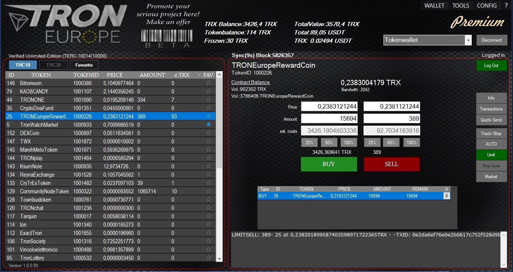
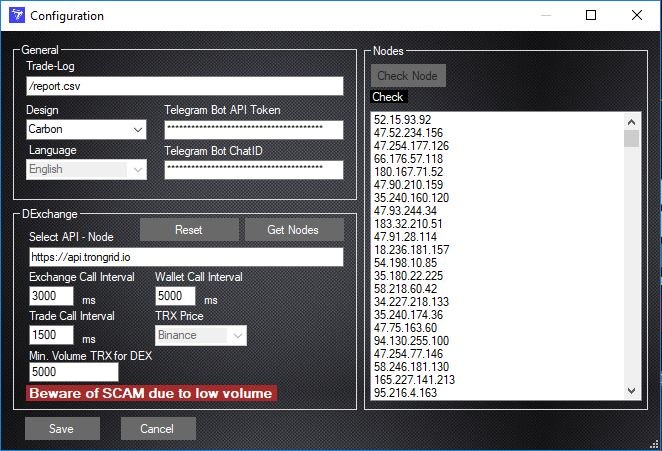
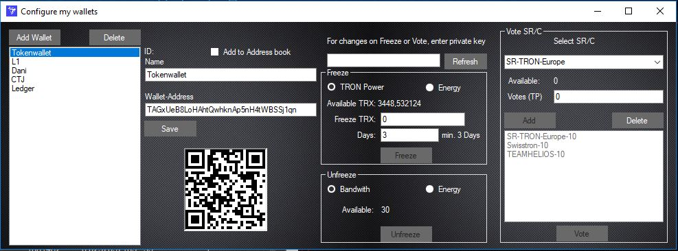
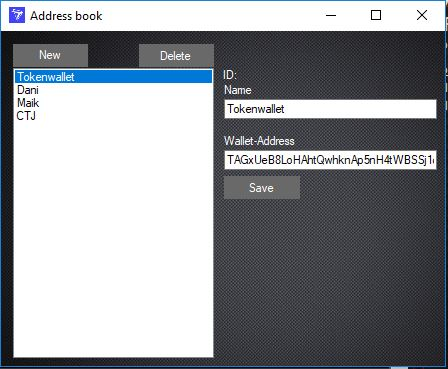
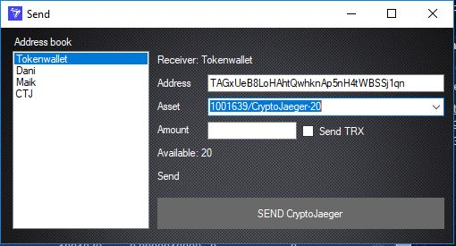
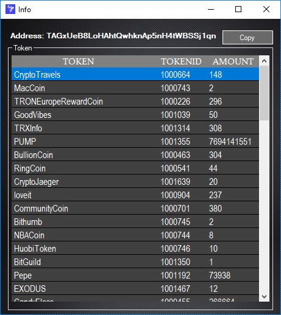
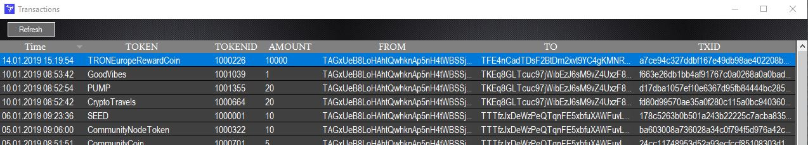
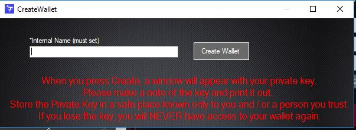
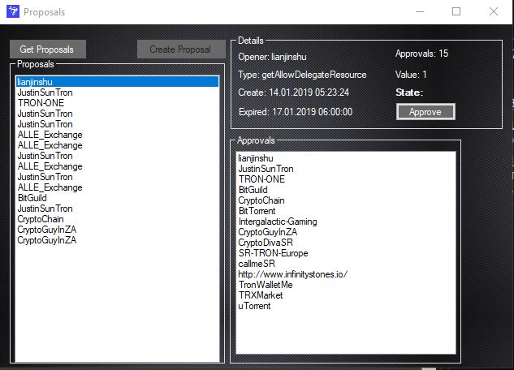
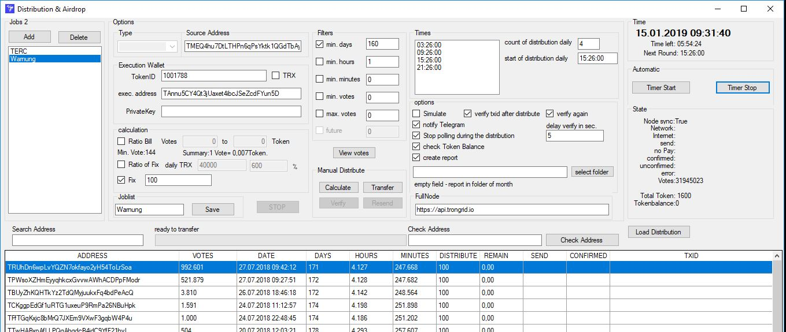
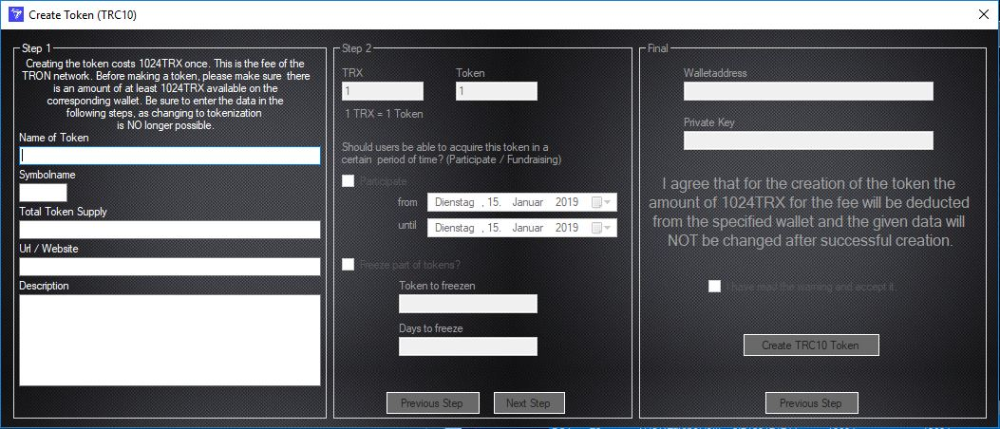
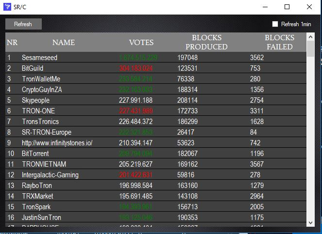

