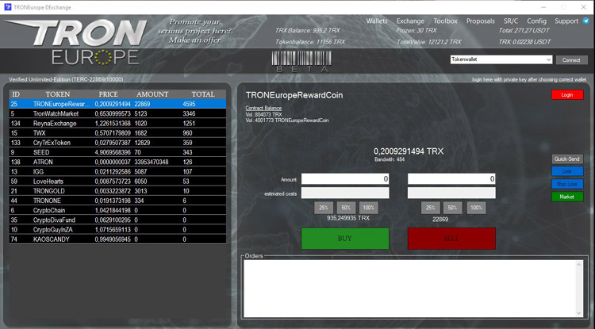
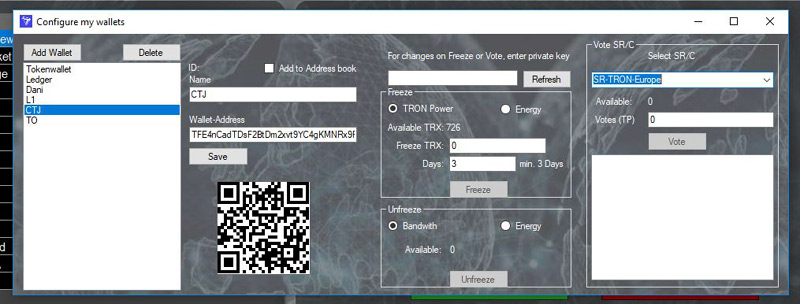
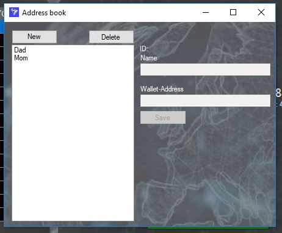
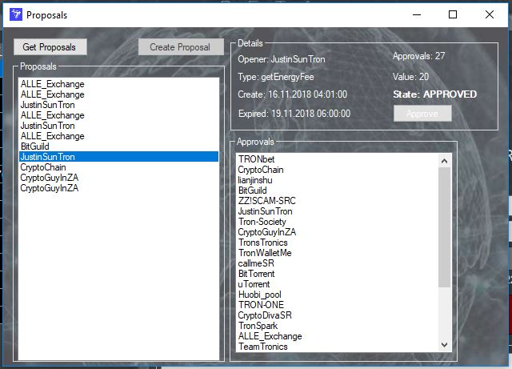
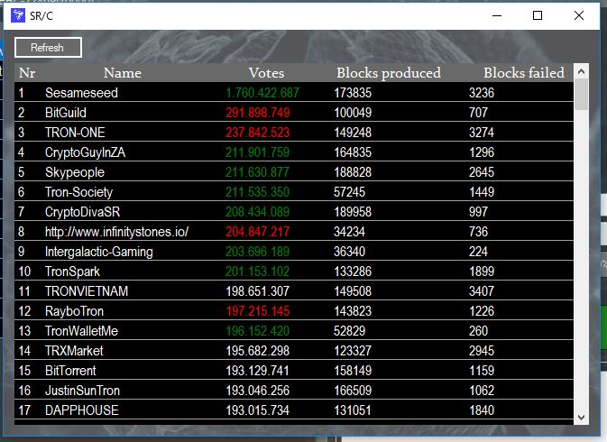
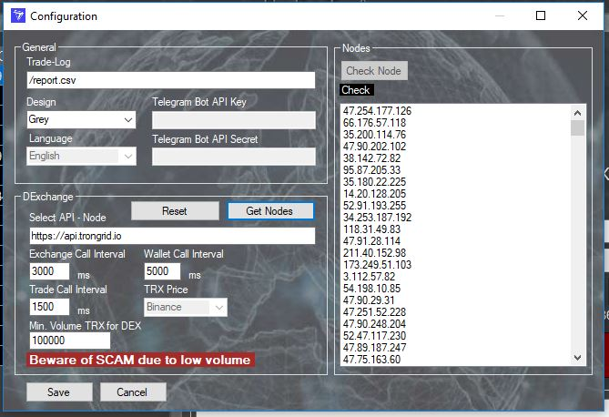

# DExchange

### Info
Building a multi-wallet software based on Microsoft Windows. This includes capturing tokens and their current 
values as well as trading them in the Exchange Contract, sending TRX and all tokens. It provides all functionalities
of the Tron network including reward distribution, airdrops, proposals, voting, freezing, import of payment orders,
Ledger integretation and many other useful features. With the software you can communicate via any, current FullNode.
The project is at an advanced stage and will soon be released for publication. It is free for the community.

### actually work at
* Distribution / Airdrop Job List
* Ledger integration

### Versions

### 1.0.0.53 
* Add Distribution
* Fix SR/C Table

### 1.0.0.0 initial release

